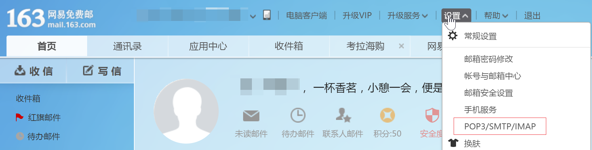
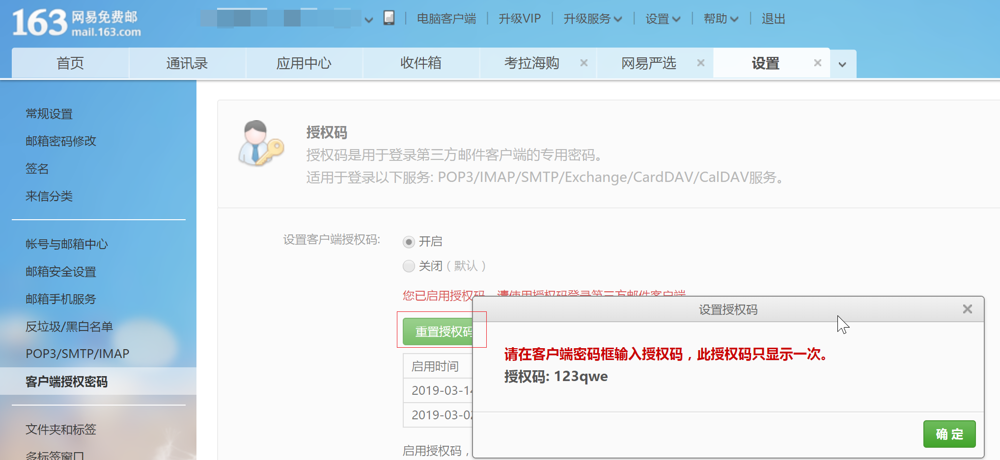
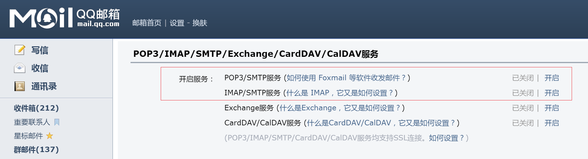
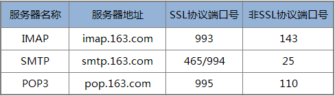
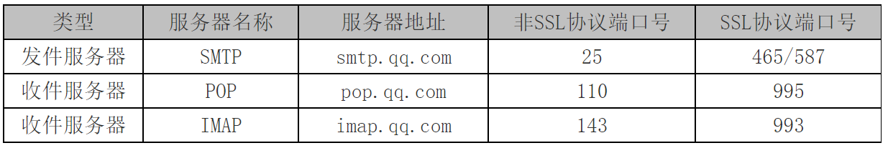

# Node 环境下载

Node 官网下载：http://nodejs.cn/download/


#  VS Code 编辑器下载

VS Code下载： https://code.visualstudio.com/


# 💕 项目主要功能

1. 利用Node实现网页爬虫抓取数据。
2. 利用模版引擎制作HTML邮件。
3. 利用Node发送电子邮件。
4. 利用Node实现定时执行任务。


## 项目依赖包

| 依赖包名称         | 功能描述   | npm 项目地址                                 |
| ------------- | ------ | ---------------------------------------- |
| superagent    | HTTP请求 | [查看npm项目地址](https://www.npmjs.com/package/superagent) |
| cheerio       | 解析HTML | [查看npm项目地址](<https://www.npmjs.com/package/cheerio>) |
| art-template  | 模版引擎   | [查看npm项目地址](https://www.npmjs.com/package/art-template) |
| nodemailer    | 发送电子邮件 | [查看npm项目地址](https://www.npmjs.com/package/nodemailer) |
| node-schedule | 定时任务   | [查看npm项目地址](https://www.npmjs.com/package/node-schedule) |

1. 初始化项目

```shell
npm init -y
```

2. 安装项目所有依赖包

```shell
npm install superagent cheerio art-template node-schedule nodemailer
```


## 邮件内容布局参考

注意事项：邮件只允许行内样式。

```html
<!DOCTYPE html>
<html lang="en">
    <head>
        <meta charset="UTF-8" />
        <meta name="viewport" content="width=device-width, initial-scale=1.0" />
        <title>爱的邮件</title>
    </head>
    <body style="margin:0;padding:0;">
        <div
            style="width:100%; margin: 40px auto;font-size:20px; color:#5f5e5e;text-align:center"
        >
            <span>今天是我们在一起的第</span>
            <span style="font-size:24px;color:rgb(221, 73, 73)">
                520
            </span>
            <span>天</span>
        </div>
        <div style="width:100%; margin: 0 auto;color:#5f5e5e;text-align:center">
            
            <b style="display:block;color:#333;font-size:24px;margin:15px 0;"
                >天气：阴</b
            >
            <span style="display:block;color:#333;font-size:22px;margin:15px 0;"
                >温度：19</span
            >

            <span style="display:block;color:#676767;font-size:20px"
                >提示：今天有雨，冷热适宜，感觉很舒适。</span
            >
        </div>
        <div style="text-align:center;margin:35px 0;">
            <span
                style="display:block;margin-top:55px;color:#676767;font-size:15px"
                >ONE · 一个</span
            >
            <span
                style="display:block;margin-top:25px;font-size:22px; color:#9d9d9d; "
                >2019 / 3 / 14</span
            >
            
            <div style="margin:10px auto;width:85%;color:#5f5e5e;">
                若深情不能对等，愿爱得更多的人是我。
            </div>
        </div>
    </body>
</html>

```


## 邮箱设置

### 163邮箱设置



> 设置客户端授权密码



### QQ邮箱账号设置




网易邮箱端口号



QQ邮箱端口号



## Node 发送邮件中文注释

```js
// 导入 发送邮件的包
const nodemailer = require("nodemailer");

async function sendNodeMail() {
    // HTML 页面内容
    const html = "<h1>这是HTML内容666</h1>";
    console.log(html);
    // 使用默认SMTP传输，创建可重用邮箱对象
    let transporter = nodemailer.createTransport({
        host: "smtp.163.com",
        port: 465,
        secure: true, // 开启加密协议，需要使用 465 端口号
        auth: {
            user: "gzqd201802@163.com", // 用户名
            pass: "1234qwer" // 授权密码
        }
    });

    // 设置电子邮件数据
    let mailOptions = {
        from: '"广州传智播客前端" <gzqd201802@163.com>', // 发件人邮箱
        to: "gzqd201803@163.cn", // 收件人列表
        subject: "一封爱的邮件", // 标题
        html: html // html 内容
    };

    transporter.sendMail(mailOptions, (error, info = {}) => {
        if (error) {
            console.log(error);
            sendNodeMail(); //再次发送
        }
        console.log("邮件发送成功", info.messageId);
        console.log("静等下一次发送");
    });
}
```


# 📙 项目参考代码

> 记得修改成自己的邮箱地址！！！

1. 初始化项目

```shell
npm init -y
```

2. 安装项目所有依赖包

```shell
npm install superagent cheerio art-template node-schedule nodemailer
```

3.  核心代码参考

```js
// 2.0 引入 superagent 包，用于 Node 服务器发送http请求
const request = require("superagent");
// 3.0 导入 cheerio，把字符串解析成 HTML
const cheerio = require("cheerio");
// 4.0 导入模板引擎
const template = require("art-template");
// 4.0.1 导入 path 模块处理路径
const path = require("path");
// 5.0 导入 发送邮件的包
const nodemailer = require("nodemailer");
// 6.0 导入 定时任务模块
const schedule = require("node-schedule");

// 1.0 计算爱人认识的天数
function getDayData() {
    return new Promise((resolve, reject) => {
        // 现在的时间
        const today = new Date();
        // 认识的时间 2019-03-01
        const meet = new Date("2019-03-01");
        // 计算相识到今天的天数，毫秒值，1000毫秒1秒，60秒1分，60分1小时，24小时1天
        const count = Math.ceil((today - meet) / 1000 / 60 / 60 / 24);
        // 今天日期格式化
        const format =
            today.getFullYear() +
            " / " +
            (today.getMonth() + 1) +
            " / " +
            today.getDate();
        const dayData = {
            count,
            format
        };
        // console.log(dayData);
        resolve(dayData);
    });
}
// getDayData();

// 2.1 请求墨迹天气获取数据
function getMojiData() {
    return new Promise((resolve, reject) => {
        request
            .get("https://tianqi.moji.com/weather/china/guangdong/guangzhou")
            .end((err, res) => {
                if (err) return console.log("数据请求失败，请检查路径");
                // console.log(res.text);
                // 把字符串解析成THML，并可用 jQuery 核心选择器获取内容
                const $ = cheerio.load(res.text);
                // 图标
                const icon = $(".wea_weather span img").attr("src");
                // 天气
                const weather = $(".wea_weather b").text();
                // 温度
                const temperature = $(".wea_weather em").text();
                // 提示
                const tips = $(".wea_tips em").text();
                // 墨迹天气数据
                const mojiData = {
                    icon,
                    weather,
                    temperature,
                    tips
                };
                // console.log(mojiData);
                resolve(mojiData);
            });
    });
}
// getMojiData();

// 3.1 请求 One 页面抓取数据
function getOneData() {
    return new Promise((resolve, reject) => {
        request.get("http://wufazhuce.com/").end((err, res) => {
            if (err) return console.log("请求失败");

            // 把返回值中的页面解析成 HTML
            const $ = cheerio.load(res.text);
            // 抓取 one 的图片
            const img = $(
                ".carousel-inner>.item>img, .carousel-inner>.item>a>img"
            )
                .eq(0)
                .attr("src");
            // 抓取 one 的文本
            const text = $(".fp-one .fp-one-cita-wrapper .fp-one-cita a")
                .eq(0)
                .text();
            // one 数据
            const oneData = {
                img,
                text
            };
            // console.log(oneData);
            resolve(oneData);
        });
    });
}
// getOneData();

// 4.0 通过模板引起替换 HTML 的数据
async function renderTemplate() {
    // 获取 日期
    const dayData = await getDayData();
    // 获取 墨迹天气数据
    const mojiData = await getMojiData();
    // 获取 One 的数据
    const oneData = await getOneData();
    // console.log(dayData);
    // console.log(mojiData);
    // console.log(oneData);
    // 2. 所有数据都获取成功的时候，才进行模板引擎数据的替换
    return new Promise((resolve, reject) => {
        const html = template(path.join(__dirname, "./love.html"), {
            dayData,
            mojiData,
            oneData
        });
        // console.log(html);
        resolve(html);
    });
}
// renderTemplate();

// 5. 发送邮件
async function sendNodeMail() {
    // HTML 页面内容，通过 await 等待模板引擎渲染完毕后，再往下执行代码
    const html = await renderTemplate();
    // console.log(html);
    // 使用默认SMTP传输，创建可重用邮箱对象
    let transporter = nodemailer.createTransport({
        host: "smtp.163.com",
        port: 465,
        secure: true, // 开启加密协议，需要使用 465 端口号
        auth: {
            user: "***@163.com", // 用户名
            pass: "***" // 客户端授权密码
        }
    });

    // 设置电子邮件数据
    let mailOptions = {
        from: '"帅气的小哥哥" <***@163.com>', // 发件人邮箱
        to: "***@**.com", // 收件人列表
        subject: "这个一封充满爱的邮件", // 标题
        html: html // html 内容
    };
    // 发送邮件
    transporter.sendMail(mailOptions, (error, info = {}) => {
        if (error) {
            console.log(error);
            sendNodeMail(); //再次发送
        }
        console.log("邮件发送成功", info.messageId);
        console.log("静等下一次发送");
    });
}
// sendNodeMail();

// 6. 定时每天 5时20分14秒发送邮件给女（男）朋友
// 6.1 创建定时器任务
schedule.scheduleJob("14 20 5 * * *", function() {
    // 时间到了，执行发送邮件的任务
    sendNodeMail();
    console.log("定时任务的邮件发送成功");
});

```

